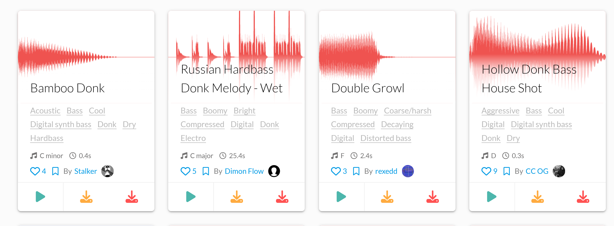

<div align="center">


# SampleTap

**samplefocus.com の試聴音源を、その場で1つ落とす。**
ダウンロードボタンの隣に、同じ形の赤いボタンを1つ足すだけ。

Chrome / Edge · Manifest V3 · MIT License



</div>

---

## これは何

[SampleFocus](https://samplefocus.com) のサンプル一覧で、カード下の操作列（▶ と ⬇ が並ぶ行）に**赤いダウンロードボタン**を1つ足す拡張機能です。押すと、そのカードの試聴音源がそのまま保存されます。

ボタンは自作しません。**サイト自身のダウンロードボタンを複製して色だけ変えて**います。だから大きさ・余白・角丸・波紋エフェクトは本家と1pxも違わず、行の高さも変わりません。

作りも引き算です。ポップアップも設定画面もありません。権限は `downloads` と `samplefocus.com` の2つだけ。

## できること

- **カードごとに赤いダウンロードボタン** — 既存のダウンロードボタンの右隣、同じ行に入る
- **ファイル名はサンプル名** — `ダウンロード/SampleFocus/<サンプル名>.mp3` に落ちる
- **押した結果が色で返る** — 実行中は回転、成功で緑のチェック、失敗で暗赤。理由はツールチップに出る
- **再生しない** — 音を鳴らさずに URL を引くので、試聴中の曲を止めたり、別の曲が混ざったりしない
- **ページ送り・フィルタに追従** — 後から差し替わったカードにもボタンが付く

## 動かすもの

| | |
|---|---|
| ブラウザ | Chrome / Edge（Manifest V3、`world: "MAIN"` を使うので Chrome 111 以降） |
| 必要なもの | なし。ビルド不要・依存ゼロ |

## 入れる

インストーラーもビルドもありません。このリポジトリをそのまま読み込みます。

1. `chrome://extensions` を開く
2. 右上の **デベロッパーモード** を ON
3. **「パッケージ化されていない拡張機能を読み込む」** → このフォルダを選ぶ
4. https://samplefocus.com/tag/hardbass などを開く（開いていたらリロード）

```sh
git clone https://github.com/nisesimadao/SampleTap.git
```

> `--load-extension` は Chrome 137 以降のコマンドラインでは無視されます。上の
> 「パッケージ化されていない拡張機能を読み込む」から入れてください。

## 仕組み

作るうえで引っかかったところを残しておきます。

**再生を横取りするのは間違いだった**
最初は「再生ボタンを一瞬押して、流れ出した音源の URL を掴む」方式にしていました。これは**別のサンプルが落ちてくる**。同時に鳴っている音は1つしかないので、掴めるのは「今鳴っている音」であって「押したカードの音」ではないからです。前の再生が残っていたり、取得が間に合わなかったりすると、平然と隣の曲を保存します。

正解はもっと手前にありました。SampleFocus は React on Rails で、**ページに埋め込まれた `<script type="application/json">` の中に全サンプルの `sample_mp3_url` が最初から入っています**。つまり再生しなくても、一覧を開いた時点で20件ぶんの正解 URL が手元にある。カード側の `a.sample-card-link` から取った slug を鍵にこれを引けば、取り違えは原理的に起きません。

**波形画像の URL からは導出できない**
同じサンプルでも、波形 PNG と mp3 ではパスの途中のハッシュが違います。

```
.../sample_files/652477/edda4fd01db352b0cef2d6148cf62a8429b32906/waveform/_cc_donk_classic_d.png
.../sample_files/652477/dd27d465fe995e819faa03217e81b8fea9c78083/mp3/_cc_donk_classic_d.mp3
```

共通なのはサンプル ID (`652477`) とファイル名だけ。だから「波形の URL を書き換えて mp3 にする」は成立しません。ID は照合の鍵としてだけ使っています。

**CDN は Referer の無い要求を 403 で返す**
`chrome.downloads` にそのまま mp3 の URL を渡すと落ちてきません。ブラウザ本体のダウンローダは Referer を送らないからです（実測: ヘッダ無し → 403、`Referer: https://samplefocus.com/` を付けると 200）。

なので**取得はページ文脈の `fetch` でやります**。サイト自身が試聴で叩いているのと同じ経路なので、Referer も Origin もブラウザが勝手に付けてくれるし、CORS も同じ条件で通る。CDN のドメインに `host_permissions` を張る必要もありません。取れた Blob を data URL にして `chrome.downloads` へ渡し、サブフォルダ付きで保存します。data URL が通らなかったときは `<a download>` に落とします（この場合サブフォルダは付きません）。

**ボタンは複製する**
emotion のクラス名（`css-1yu56n3` など）はビルドごとに変わるので決め打ちできません。現物のダウンロードボタンを `cloneNode` して `sfdl-btn` を足し、CSS で色だけ上書きしています。複製したノードには React の内部プロパティが付いてこないので、本家のクリックハンドラが誤爆することもありません。3つ並ぶと右下の角丸が余るので、そこだけ本家から末尾のこちらへ付け替えています。

**fiber を読む係は MAIN world に置く**
content script（ISOLATED world）からは、ページが DOM 要素に生やした `__reactFiber$…` のようなプロパティが見えません。埋め込み JSON に載っていないカードを拾う最後の砦として fiber を辿る必要があるので、その係だけ `world: "MAIN"` で走らせ、slug / ID を鍵にした問い合わせに `postMessage` で答えさせています。

## 確かめたこと

実際の https://samplefocus.com/tag/hardbass に対して:

- 一覧20枚すべてで、ボタンが要求する URL が**そのカードの正解 mp3 と一致**（不一致 0 件、URL は20件とも別物）
- 複製ボタンの `padding` / `display` / `font-size` / `line-height` / `flex-basis` / `cursor` / `text-align` が本家と一致、寸法 74×46px も一致、行の高さは 47px のまま
- 実 CDN から取得して保存まで通ること（`Bamboo Donk.mp3` 3,170 bytes / `Russian Hardbass Donk Melody - Wet.mp3` 195,025 bytes、いずれも先頭 `ID3`）

## うまく動かないとき

**ボタンが出ない** — カードの構造が変わった可能性があります。コンソールで下を実行して、出力を [Issues](../../issues) へ。

```js
console.log(document.querySelectorAll('.sample-card').length,
            document.querySelectorAll('.sf-card-action [aria-label="Download"]').length);
```

**押しても落ちてこない** — コンソールに `[SampleTap]` 付きの警告が出ます。URL とエラーがそこに載ります。

## 注意

保存されるのは**サイトが試聴に使っている音源そのもの**です。正規のダウンロードで得られるファイルとは別物のことがあります。落とした素材の扱いは SampleFocus の利用規約と各サンプルのライセンスに従ってください。

## ライセンス

[MIT](LICENSE)
