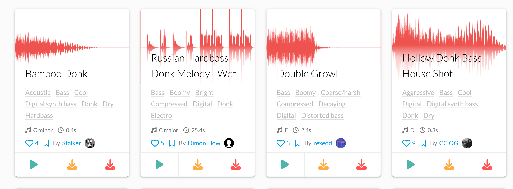

<div align="center">


# SampleTap

SampleTap は、SampleFocus の一覧カードへ試聴音源の保存ボタンを追加する Chrome / Edge 拡張機能です。

Chrome / Edge · Manifest V3 · MIT License



</div>

## 概要

[SampleFocus](https://samplefocus.com) のサンプルカードに、既存のダウンロードボタンを基にした赤いボタンを追加します。
押すと、そのカードに対応する試聴用 MP3 を保存します。

ボタンは既存要素を複製し、色と必要な角丸だけを上書きします。
ポップアップや設定画面はなく、拡張権限は `downloads` と `samplefocus.com` へのアクセスだけです。

## 主な機能

- **カードごとの保存ボタン**：既存の操作列へ追加します。
- **ファイル名**：`Downloads/SampleFocus/<sample name>.mp3` の形式で保存します。
- **状態表示**：処理中、成功、失敗をボタンの表示で示し、失敗理由は tooltip に表示します。
- **再生状態に依存しない取得**：対象カードの音源 URL をデータから解決するため、別のカードの再生状態を利用しません。
- **動的な一覧に対応**：ページ送りやフィルタで後から追加されたカードにもボタンを挿入します。

## 動作環境

| 項目 | 要件 |
| --- | --- |
| ブラウザ | Chrome / Edge。Manifest V3 の `world: "MAIN"` を使用するため Chrome 111 以降 |
| ビルド | 不要 |
| 依存関係 | なし |

## インストール

```sh
git clone https://github.com/nisesimadao/SampleTap.git
```

1. `chrome://extensions` を開きます。
2. **デベロッパーモード** を有効にします。
3. **パッケージ化されていない拡張機能を読み込む** から、このリポジトリのフォルダを選択します。
4. SampleFocus の一覧ページを開くか、すでに開いている場合は再読み込みします。

> Chrome 137 以降では、通常の Chrome で `--load-extension` が無視される場合があります。
> その場合は拡張機能ページから読み込んでください。

## 実装

### 音源 URL の特定

初期実装では、再生ボタンを一時的に操作して再生中 URL を取得していました。
この方法では、取得時点で別のカードが再生されていると誤った音源を保存する可能性があります。

SampleFocus のページには `<script type="application/json">` があり、一覧にあるサンプルの `sample_mp3_url` が含まれています。
SampleTap はカードの `a.sample-card-link` から得た slug を使って、そのデータから対象 URL を特定します。

埋め込み JSON にないカードに対しては、MAIN world で React fiber を参照する補助経路を使用します。
content script と MAIN world の間は `postMessage` で slug / ID をやり取りします。

### 波形 URL は MP3 URL へ変換しない

波形画像と MP3 は、同じサンプルでも CDN パス中の hash が異なります。

```text
.../sample_files/652477/edda4fd01db352b0cef2d6148cf62a8429b32906/waveform/_cc_donk_classic_d.png
.../sample_files/652477/dd27d465fe995e819faa03217e81b8fea9c78083/mp3/_cc_donk_classic_d.mp3
```

共通の sample ID や filename は照合に使えますが、waveform URL の文字列置換だけでは MP3 URL を導出できません。

### CDN からの取得

確認した CDN では、Referer のない MP3 リクエストが 403 になりました。
そのため、MP3 はページ文脈の `fetch` で取得します。

取得した Blob は data URL に変換して `chrome.downloads` へ渡します。
data URL を利用できない場合は `<a download>` へフォールバックしますが、その場合は `SampleFocus/` サブフォルダを指定できません。

### 既存ボタンを複製する理由

emotion が生成する class 名はビルドごとに変わるため、固定 class を前提にしません。
既存のダウンロードボタンを `cloneNode` し、`sfdl-btn` を付けて色だけ変更します。

React の内部プロパティは複製ノードへ引き継がれないため、元ボタンの React click handler は複製側では実行されません。

## 確認した挙動

`https://samplefocus.com/tag/hardbass` を使った確認では、次を検証しました。

- 20 枚のカードで、各ボタンが取得する URL と対象カードの MP3 URL が一致しました。
- 20 件の URL はすべて異なっていました。
- 複製ボタンの主要な CSS 値と 74×46 px の寸法が既存ボタンと一致し、操作列の高さは 47 px のままでした。
- CDN から MP3 を取得して保存できることを確認しました。

これらは確認時点の SampleFocus の実装に対する結果です。
サイト側の構造や配信方式が変わると動作しなくなる可能性があります。

## トラブルシューティング

**ボタンが表示されない**  
SampleFocus 側のカード構造が変わっている可能性があります。
ブラウザのコンソールで次を実行し、結果を [Issues](../../issues) へ添えてください。

```js
console.log(document.querySelectorAll('.sample-card').length,
            document.querySelectorAll('.sf-card-action [aria-label="Download"]').length);
```

**押しても保存されない**  
ブラウザのコンソールに `[SampleTap]` から始まる警告が出ていないか確認してください。
失敗した URL とエラー内容を記録します。

## 注意

SampleTap が保存するのは、SampleFocus が試聴に使用している音源です。
SampleFocus の通常のダウンロード機能が提供するファイルと同一とは限りません。
保存した素材の利用条件は、SampleFocus の利用規約と各サンプルのライセンスを確認してください。

## ライセンス

[MIT](LICENSE)
